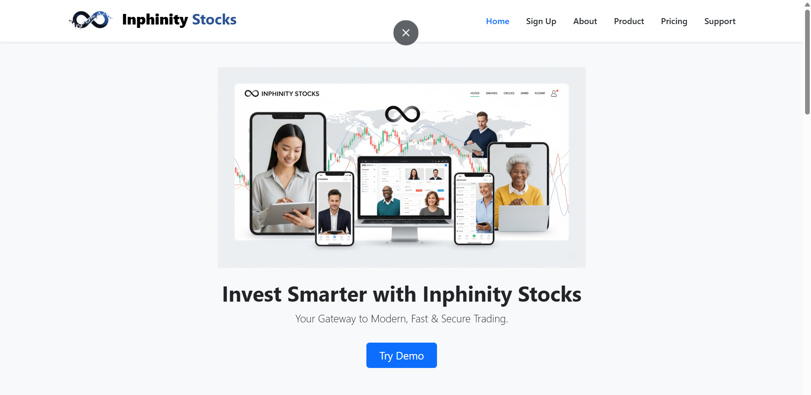

# 🚀 Inphinity Stocks: Full Stack Stock Trading Web App

**Inphinity Stocks** is a powerful stock trading simulation platform built using the **MERN Stack (MongoDB, Express.js, React.js, Node.js)**. It enables users to view real-time stock updates, manage a virtual portfolio, and interact with dynamic dashboards and visual data.

> 🔥 Built with a vision to replicate a stock investments like experience with a custom UI and learning-focused features.

---

## 📸 Screenshots



---

## 🌐 Live Demo

🔗 [Try Infinity Stocks Live](https://inphinity.in)  

---

## 🛠️ Tech Stack

- **Frontend:** React.js, Bootstrap, CSS Modules
- **Dashboard:** React.js, Chart.js, Axios
- **Backend:** Node.js, Express.js, MongoDB Atlas

---

## ✨ Key Features

- 📈 **Real-time stock data updates** 
- 🔐 **User-friendly dashboard and portfolio view**
- 📊 **Interactive charts and visual insights**
- 🧠 Modular, clean code with reusable components
- 💬 Built with future enhancements like auth, live APIs, and orders

---

## 🧾 Project Structure

inphinity-stocks/ <br>
├── frontend <br>
├── dashboard <br>
├── backen <br>
└── README.md

## 🧪 Local Development Setup

```
npm install
npm start 
```

## 💬Author

Author: Priyanshu Chaudhary <br>
📧 Email: priyanshukaushal14@gmail.com <br>
🌐 LinkedIn: https://www.linkedin.com/in/priyanshu-chaudhary-1b7593255/ <br>
Happy Investing! ✨

